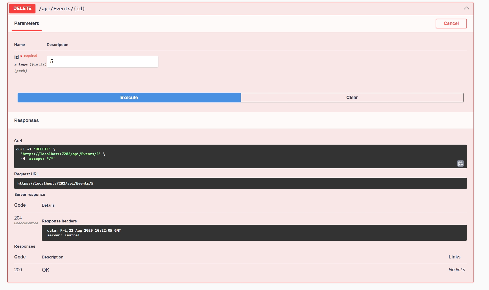
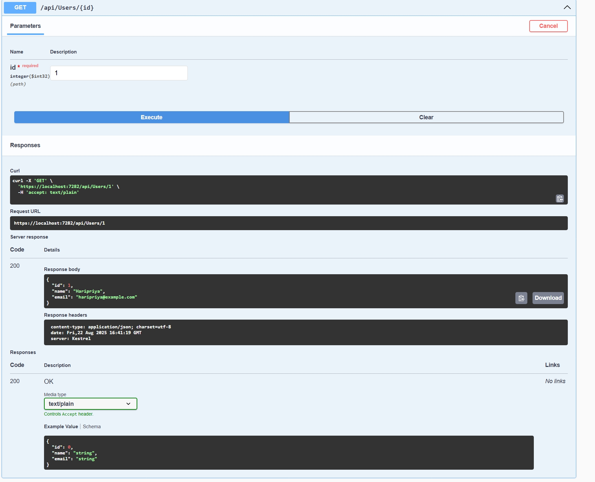
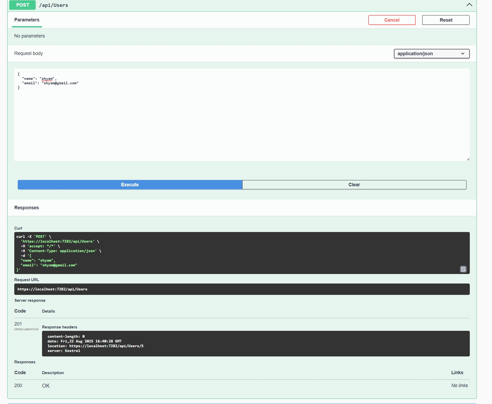
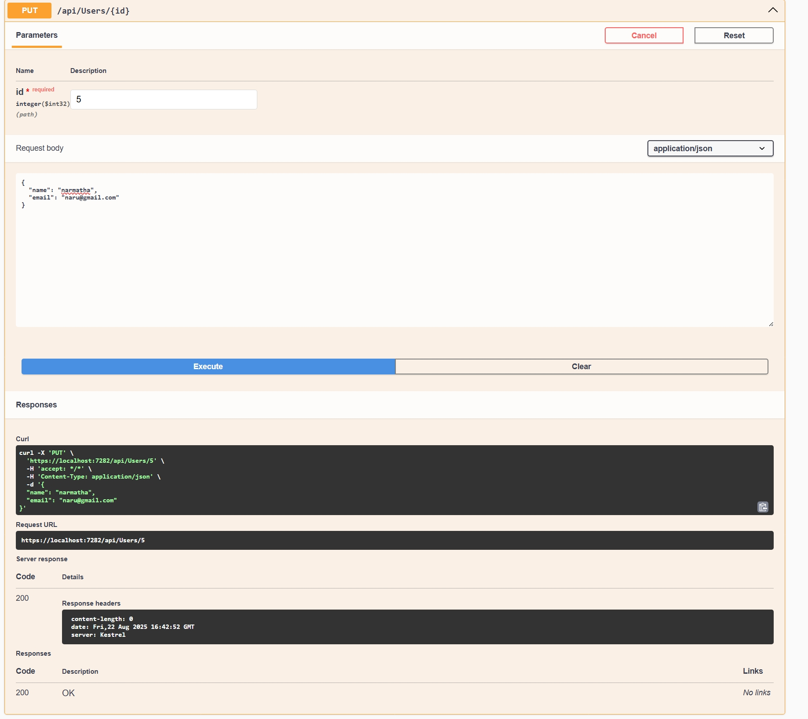
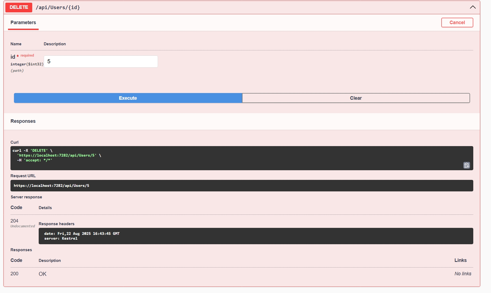
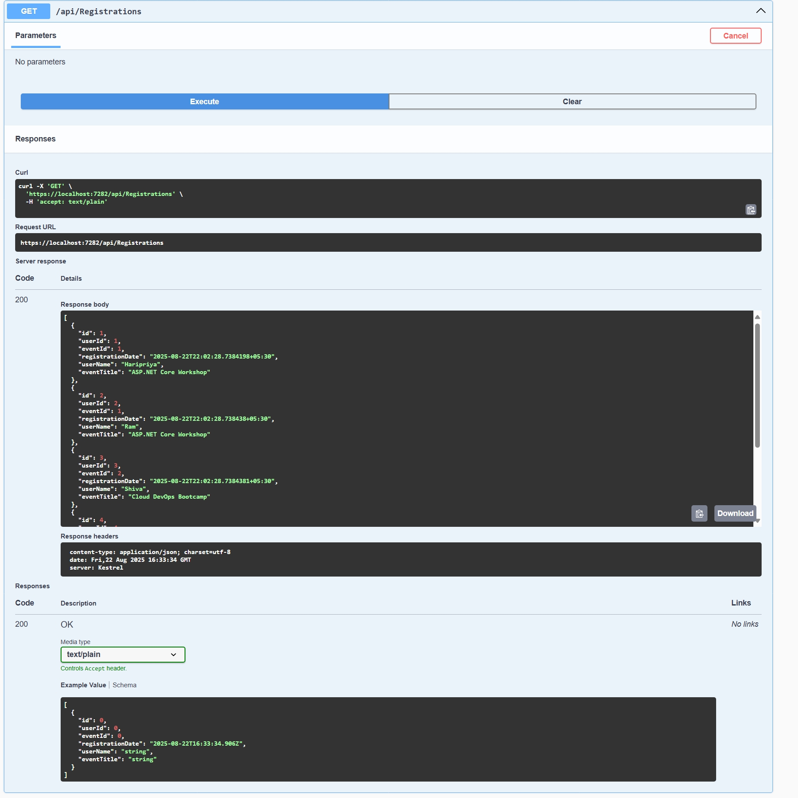
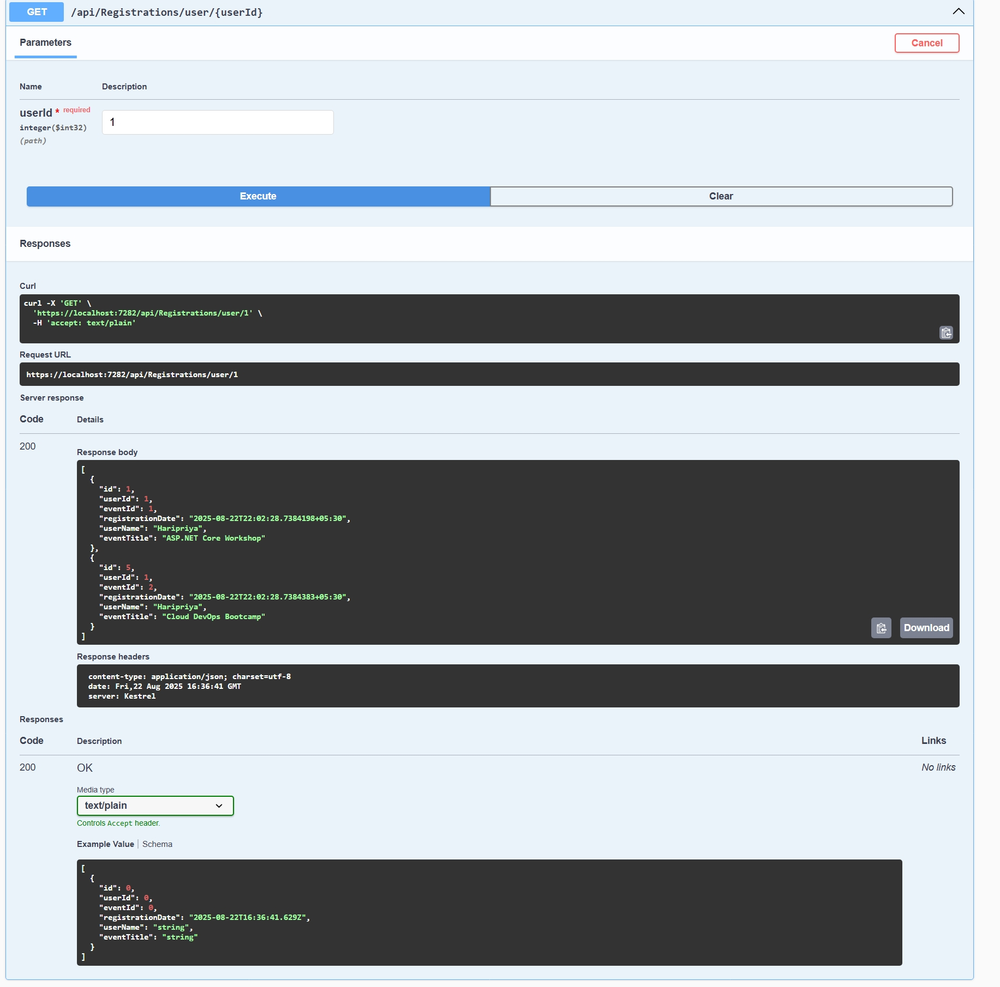
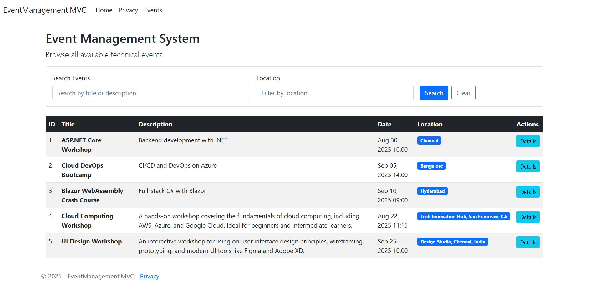

 # 🎉 Event Management System

 A comprehensive, layered ASP.NET Core Web API with MVC frontend for managing technical events, users, and registrations. Built following **Clean Architecture** principles with full CRUD operations, advanced filtering, and comprehensive testing.

 ---

 ## 📚 Project Overview

 The **Event Management System** is a full-stack solution featuring:

 - 🎫 Complete event management with CRUD operations
 - 👥 User management with validation
 - 🔗 Event registration system with business rules
 - 🔍 Advanced filtering and search capabilities
 - 🌐 MVC frontend with responsive Bootstrap UI
 - 🛡️ Comprehensive exception handling system
 - 🧪 Extensive unit testing with xUnit and Moq
 - 📖 Auto-generated Swagger API documentation

 ---

 ## 🚀 Features Implemented

 ### ✅ Core Features
 - **Event Management**: Full CRUD operations (Create, Read, Update, Delete)
 - **User Management**: Complete user lifecycle management
 - **Registration System**: Event registration with duplicate prevention
 - **Search & Filter**: Real-time filtering by event name and location
 - **Responsive UI**: Mobile-friendly Bootstrap interface

 ### ✅ Technical Features
 - **Clean Architecture**: Onion architecture with clear separation of concerns
 - **Global Exception Handling**: Centralized error handling with custom exceptions
 - **Unit Testing**: Comprehensive test coverage with Moq framework
 - **API Documentation**: Interactive Swagger/OpenAPI documentation
 - **Validation**: Input validation and business rule enforcement
 - **Logging**: Structured logging throughout the application

 ---

 ## 🛠️ Tech Stack

 | Layer | Technology | Purpose |
 |-------|------------|---------|
 | **Frontend** | ASP.NET Core MVC, Bootstrap 5, jQuery | User interface and client-side interactions |
 | **Backend** | ASP.NET Core Web API, C# | RESTful services and business logic |
 | **Data Access** | In-memory repositories, LINQ | Data persistence and querying |
 | **Testing** | xUnit, Moq, .NET Test SDK | Unit testing and mocking |
 | **Documentation** | Swagger/OpenAPI, Swashbuckle | API documentation |
 | **Architecture** | Clean Architecture, Dependency Injection | Maintainable and testable code structure |

 ---

 ## 📊 Entity Relationship Diagram

 ```mermaid
 erDiagram
     User {
         int Id PK
         string Name
         string Email
     }
     
     Event {
         int Id PK
         string Title
         string Description
         DateTime Date
         string Location
     }
     
     Registration {
         int Id PK
         int UserId FK
         int EventId FK
         DateTime RegistrationDate
     }
     
     User ||--o{ Registration : "registers for"
     Event ||--o{ Registration : "has registrations"
 ```

 ---

 ## 🗂️ Project Structure

 ```
 EventManagement/
 ├── 📁 Assets/                                    # Screenshots and documentation
 ├── 📁 EventManagement.Core/                      # 🏛️ DOMAIN LAYER
 │   ├── 📁 DTOs/                                  # Data Transfer Objects
 │   │   ├── ErroResponseDTO.cs
 │   │   ├── EventRequestDTO.cs
 │   │   ├── EventResponseDto.cs
 │   │   ├── RegistrationRequest.cs
 │   │   ├── RegistrationResponseDto.cs
 │   │   ├── UserRequest.cs
 │   │   └── UserResponseDto.cs
 │   ├── 📁 Entities/                              # Domain entities
 │   │   ├── Event.cs
 │   │   ├── Registration.cs
 │   │   └── User.cs
 │   ├── 📁 Exceptions/                            # Custom exceptions
 │   │   ├── DuplicateEventException.cs
 │   │   ├── DuplicateRegistrationException.cs
 │   │   ├── DuplicateUserException.cs
 │   │   ├── EventCapacityExceededException.cs
 │   │   ├── InvalidDateException.cs
 │   │   ├── InvalidEmailException.cs
 │   │   ├── NotFoundException.cs
 │   │   └── ValidationException.cs
 │   └── 📁 Interfaces/                            # Service contracts
 │       ├── IEventService.cs
 │       ├── IRegistrationService.cs
 │       ├── IRepository.cs
 │       └── IUserService.cs
 │
 ├── 📁 EventManagement.Application/               # 🔧 APPLICATION LAYER
 │   └── 📁 Services/                              # Business logic
 │       ├── EventService.cs
 │       ├── Registration.cs (RegistrationService)
 │       └── UserService.cs
 │
 ├── 📁 EventManagement.Infrastructure/            # 🗄️ INFRASTRUCTURE LAYER
 │   └── 📁 Repositories/                          # Data access
 │       ├── EventRepository.cs
 │       ├── RegistrationRepository.cs
 │       └── UserRepository.cs
 │
 ├── 📁 EventManagementAPI/                        # 🌐 WEB API LAYER
 │   ├── 📁 Controllers/                           # API endpoints
 │   │   ├── EventController.cs
 │   │   ├── HomeController.cs
 │   │   ├── RegistrationController.cs
 │   │   └── UserController.cs
 │   ├── 📁 Middleware/                            # Custom middleware
 │   │   └── GlobalExceptionMiddleware.cs
 │   └── Program.cs
 │
 ├── 📁 EventManagement.MVC/                       # 🖥️ MVC FRONTEND
 │   ├── 📁 Controllers/                           # MVC controllers
 │   │   ├── EventViewControllercs.cs
 │   │   └── HomeController.cs
 │   ├── 📁 Models/                                # View models
 │   │   ├── ErrorViewModel.cs
 │   │   ├── EventViewModel.cs
 │   │   ├── RegistartionViewModel.cs
 │   │   └── UserViewModel.cs
 │   └── 📁 Views/                                 # Razor views
 │       ├── 📁 Events/
 │       │   ├── Details.cshtml
 │       │   └── Index.cshtml
 │       └── 📁 Shared/
 │           ├── _Layout.cshtml
 │           └── Error.cshtml
 │
 ├── 📁 EventManagement.Tests/                     # 🧪 TESTING LAYER
 │   └── UnitTest1.cs
 │
 └── EventManagement.sln                           # Solution file
 ```

 ---

 ## 🚦 Installation & Setup

 ### Prerequisites
 - .NET 8 SDK or newer
 - Visual Studio 2022 or VS Code
 - Git

 ### Installation Steps

 1. **Clone the repository**
 ```bash
 git clone <repository-url>
 cd EventManagement
 ```

 2. **Restore dependencies**
 ```bash
 dotnet restore
 ```

 3. **Build the solution**
 ```bash
 dotnet build
 ```

 4. **Run tests**
 ```bash
 dotnet test
 ```

 5. **Start the API** (Terminal 1)
 ```bash
 dotnet run --project EventManagementAPI
 ```

 6. **Start the MVC app** (Terminal 2)
 ```bash
 dotnet run --project EventManagement.MVC
 ```

 ### Access Points
 - **API Swagger Documentation**: `https://localhost:7282/swagger`
 - **MVC Web Application**: `https://localhost:7283`

 ---

 ## 📖 Usage

 ### API Usage
 1. Navigate to `https://localhost:7282/swagger`
 2. Explore available endpoints
 3. Test API operations directly from Swagger UI
 4. Use the provided sample data for testing

 ### MVC Usage
 1. Navigate to `https://localhost:7283`
 2. Browse events in the main listing
 3. Use search and filter functionality
 4. View event details and registrations
 5. Navigate between different sections

 ---

 ## 🌐 API Documentation

 ### 📅 Events Endpoints

 | Method | Endpoint | Description | Request Body | Response |
 |--------|----------|-------------|--------------|----------|
 | GET | `/api/events` | Get all events | None | `EventResponseDto[]` |
 | GET | `/api/events/{id}` | Get event by ID | None | `EventResponseDto` |
 | POST | `/api/events` | Create new event | `EventRequestDTO` | `EventResponseDto` |
 | PUT | `/api/events/{id}` | Update event | `EventRequestDTO` | `EventResponseDto` |
 | DELETE | `/api/events/{id}` | Delete event | None | `204 No Content` |

 ### 👥 Users Endpoints

 | Method | Endpoint | Description | Request Body | Response |
 |--------|----------|-------------|--------------|----------|
 | GET | `/api/users` | Get all users | None | `UserResponseDto[]` |
 | GET | `/api/users/{id}` | Get user by ID | None | `UserResponseDto` |
 | POST | `/api/users` | Create new user | `UserRequest` | `UserResponseDto` |
 | PUT | `/api/users/{id}` | Update user | `UserRequest` | `UserResponseDto` |
 | DELETE | `/api/users/{id}` | Delete user | None | `204 No Content` |

 ### 🔗 Registrations Endpoints

 | Method | Endpoint | Description | Request Body | Response |
 |--------|----------|-------------|--------------|----------|
 | GET | `/api/registrations` | Get all registrations | None | `RegistrationResponseDto[]` |
 | GET | `/api/registrations/event/{eventId}` | Get registrations by event | None | `RegistrationResponseDto[]` |
 | GET | `/api/registrations/user/{userId}` | Get registrations by user | None | `RegistrationResponseDto[]` |
 | POST | `/api/registrations` | Register user for event | `RegistrationRequest` | `RegistrationResponseDto` |
 | DELETE | `/api/registrations/{id}` | Delete registration | None | `204 No Content` |

 ---

 ## 🖥️ MVC Event List View

 ### Features
 - **Responsive Design**: Bootstrap-based responsive table layout
 - **Search Functionality**: Real-time search by event title and description
 - **Location Filter**: Filter events by location
 - **Combined Filters**: Use multiple filters simultaneously
 - **Event Details**: Navigate to detailed event view with registrations

 ### Search & Filter Implementation
 ```csharp
 public async Task<IActionResult> Index(string searchTerm, string location)
 {
     // API call and filtering logic
     if (!string.IsNullOrEmpty(searchTerm))
     {
         events = events.Where(e => e.Title.Contains(searchTerm, StringComparison.OrdinalIgnoreCase) || 
                                   e.Description.Contains(searchTerm, StringComparison.OrdinalIgnoreCase)).ToList();
     }
     
     if (!string.IsNullOrEmpty(location))
     {
         events = events.Where(e => e.Location.Contains(location, StringComparison.OrdinalIgnoreCase)).ToList();
     }
     
     return View(events);
 }
 ```

 ---

 ## 🛡️ Global Exception Handling

 ### Custom Exception Types
 - `ValidationException`: Input validation errors
 - `NotFoundException`: Resource not found errors
 - `DuplicateRegistrationException`: Duplicate registration attempts
 - `DuplicateUserException`: Duplicate user creation
 - `DuplicateEventException`: Duplicate event creation

 ### Global Exception Middleware
 ```csharp
 public class GlobalExceptionMiddleware
 {
     public async Task InvokeAsync(HttpContext context)
     {
         try
         {
             await _next(context);
         }
         catch (Exception ex)
         {
             await HandleExceptionAsync(context, ex);
         }
     }
     
     private static async Task HandleExceptionAsync(HttpContext context, Exception exception)
     {
         var response = new ErroResponseDTO
         {
             Timestamp = DateTime.UtcNow,
             StatusCode = GetStatusCode(exception),
             Message = GetMessage(exception),
             Details = exception.Message
         };
         
         await context.Response.WriteAsync(JsonSerializer.Serialize(response));
     }
 }
 ```

 ---

 ## 🧪 Unit Testing

 ### Testing Framework
 - **xUnit**: Primary testing framework
 - **Moq**: Mocking framework for dependencies
 - **Test Coverage**: Service layer, exception handling, business logic

 ### Sample Test Implementation
 ```csharp
 [Fact]
 public async Task RegisterUserForEventAsync_ShouldThrowDuplicateException_WhenAlreadyRegistered()
 {
     // Arrange
     var existingRegistrations = new List<Registration>
     {
         new Registration { Id = 1, UserId = 1, EventId = 1, RegistrationDate = DateTime.Now }
     };
     _mockRegistrationRepository.Setup(r => r.GetAll()).Returns(existingRegistrations);
     var request = new RegistrationRequest { UserId = 1, EventId = 1 };

     // Act & Assert
     await Assert.ThrowsAsync<DuplicateRegistrationException>(
         () => _service.RegisterUserForEventAsync(request));
 }
 ```

 ### Test Categories
 - ✅ Service layer unit tests
 - ✅ Repository interaction tests
 - ✅ Exception handling tests
 - ✅ Validation tests
 - ✅ Business logic tests

 ---
### 🔍 Key Features

#### ✅ Exception Handling
- **Global Middleware**: Centralized exception handling
- **Custom Exceptions**: Domain-specific error types
- **Structured Responses**: Consistent error format
- **Logging**: Comprehensive error logging

#### ✅ Validation System
- **Input Validation**: Request model validation
- **Business Rules**: Domain logic validation
- **Email Validation**: Format checking
- **Duplicate Prevention**: Business rule enforcement

#### ✅ Filtering & Search
- **Case-Insensitive Search**: User-friendly searching
- **Multiple Criteria**: Combined filtering options
- **Real-time Results**: Immediate feedback
- **URL Parameters**: Bookmarkable searches

#### ✅ Testing Strategy
- **Unit Tests**: Service layer testing
- **Mock Objects**: Isolated testing
- **Exception Testing**: Error scenario validation
- **Coverage**: Comprehensive test coverage

---
 ## 📸 Screenshots

 ### API Documentation
 

 ### Events Management
 | Operation | Screenshot |
 |-----------|------------|
 | Get All Events |  |
 | Get Event by ID |  |
 | Create Event |  |
 | Update Event |  |
 | Delete Event |  |

 ### User Management
 | Operation | Screenshot |
 |-----------|------------|
 | Get All Users |  |
 | Get User by ID |  |
 | Create User |  |
 | Update User |  |
 | Delete User |  |

 ### Registration Management
 | Operation | Screenshot |
 |-----------|------------|
 | Get All Registrations |  |
 | Get by Event ID |  |
 | Get by User ID |  |
 | Create Registration |  |
 | Delete Registration |  |

 ### MVC Frontend
 | Feature | Screenshot |
 |---------|------------|
 | Events List |  |
 | Event Details |  |
 | Search by Name |  |
 | Filter by Location |  |
 | Combined Filters |  |

 ### Unit Testing
 

 ---

 ## 🤝 Contributing

 1. Fork the repository
 2. Create a feature branch (`git checkout -b feature/amazing-feature`)
 3. Commit your changes (`git commit -m 'Add amazing feature'`)
 4. Push to the branch (`git push origin feature/amazing-feature`)
 5. Open a Pull Request

 ### Contribution Guidelines
 - Follow Clean Architecture principles
 - Write unit tests for new features
 - Update documentation as needed
 - Follow existing code style and conventions

 ---


 ---


 Created with ❤️ by **Hari Ram L**


